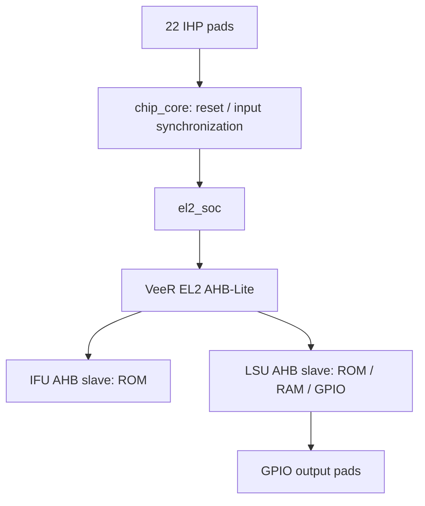

# คู่มือ VeeR EL2 Full-Chip Implementation
## LibreLane 3.x · IHP SG13G2 · RTL → Pad Ring → GDSII

รุ่นเอกสาร: 1.0 — 20 กันยายน 2026  
กลุ่มเป้าหมาย: วิศวกร ASIC/FPGA และผู้สอน RISC-V SoC  
โครงการ: `veer-el2-ihp-fullchip`  
ไฟล์หลัก: `librelane/config.yaml`

> **ขอบเขตผลตรวจสอบ:** ชุดนี้มี RTL, firmware, testbench, environment lock, configuration และคำสั่ง flow พร้อมใช้งานหลังติดตั้ง dependencies/PDK ผ่านการจำลอง EL2 และการตรวจโครงสร้างด้วย Yosys/Slang แล้ว แต่ยังไม่ได้รัน technology mapping, place-and-route, sign-off STA, DRC หรือ LVS ในสภาพแวดล้อมที่จัดทำเอกสาร จึงยังไม่ใช่ GDSII ที่ผ่าน sign-off อ่าน `VALIDATION.md` ก่อนเริ่มงาน

## สารบัญ

1. ขอบเขตและสถาปัตยกรรม
2. เวอร์ชันอ้างอิงและความสามารถที่เปิดใช้
3. โครงสร้างไฟล์
4. เตรียมเครื่องมือและ PDK
5. ตรวจแพ็กเกจและสร้าง EL2 configuration
6. Boot ROM และ firmware
7. AHB-Lite, RAM และ GPIO
8. Reset, clock และ CDC
9. RTL simulation และ acceptance criteria
10. เชื่อมต่อ IHP pad ring
11. YAML และ SDC
12. ตรวจ configuration กับ PDK จริง
13. Synthesis และ netlist checks
14. Floorplan, pad placement และ PDN
15. Placement, CTS และ timing closure
16. Routing และ extraction
17. STA, DRC, LVS, antenna และ density
18. Gate-level simulation และ equivalence
19. ดูผล, เก็บ metrics และจัดส่ง GDSII
20. Troubleshooting
21. ขยายไปใช้ SRAM macro / JTAG / application firmware
22. Laboratory sequence และแบบฟอร์มตรวจรับ
23. เอกสารอ้างอิง

---

## 1. ขอบเขตและสถาปัตยกรรม

เป้าหมายคือสร้าง **ชิปสาธิตที่ใช้ VeeR EL2 จริง** มี pad ring, supply pads, reset synchronizer, หน่วยความจำสำหรับรันโปรแกรม และ GPIO ที่ใช้ตรวจการทำงานจากภายนอก ไม่ใช่นำ CPU core ไป place-and-route โดยไม่มี IO pads

ชุดเริ่มต้นเลือก AHB-Lite และปิด ICCM/DCCM/I-cache เพื่อแยกปัญหา CPU integration ออกจากปัญหา SRAM macro mapping การปิดหน่วยความจำภายในไม่ใช่การแทน EL2 ด้วย CPU ตัวอย่าง: `src/el2_soc.sv` instantiate `el2_veer_wrapper` จาก repository ของอาจารย์โดยตรง



| รายการ | Baseline ที่ส่งมอบ |
|---|---|
| CPU | VeeR EL2 จาก upstream ที่ตรึง commit |
| Bus | AHB-Lite, data bus 64 บิต, CPU XLEN 32 บิต |
| Clock target | 50 MHz, period 20 ns; ยังไม่ยืนยัน timing closure |
| Reset | Active-low, asynchronous assertion / synchronous release |
| Boot ROM | 256 bytes; case-based synthesizable ROM |
| RAM | 256 bytes; inferred storage ที่ flow ต้อง map เป็น standard cells |
| GPIO | input 8 บิต, output 8 บิต |
| Signal pads | 18: clock 1, reset 1, GPIO 16 |
| Supply pads | 4: VDD, VSS, IOVDD, IOVSS อย่างละหนึ่ง |
| Die / core | 1600 × 1600 µm / [365,365]–[1235,1235] µm |
| Initial placement density | 35% |
| ICCM / DCCM / I-cache | ปิดทั้งหมด |
| JTAG / DMA / interrupts | ไม่เปิดให้ใช้ภายนอก; inputs ที่ไม่ใช้ผูกค่าชัดเจน |
| UART / SPI / external boot | ไม่มีใน baseline |
| SRAM hard macro | ไม่มีใน baseline; แนวทางขยายอยู่บทที่ 21 |

Boot ROM เป็น mask-ROM-style logic: ต้องแก้ RTL/ทำ synthesis ใหม่เมื่อเปลี่ยนโปรแกรม ชุดนี้ไม่มีช่องทางโหลด application ใหม่หลังผลิตชิป ไม่ควรนำไปอธิบายว่าเป็น SoC ที่รันโปรแกรมทั่วไปผ่าน JTAG หรือ SPI flash ได้แล้ว

## 2. เวอร์ชันอ้างอิงและความสามารถที่เปิดใช้

ตรวจสอบ `UPSTREAM_LOCK.json` เสมอ แพ็กเกจเก็บซอร์ส EL2 ไว้ภายใน จึงไม่ต้อง clone CPU ใหม่เพื่อรัน baseline

| องค์ประกอบ | เวอร์ชัน / commit |
|---|---|
| chumnarn/Cores-VeeR-EL2 | `925f3a34bdadc8f28b12a70cfb73e043b0f5ef3d` |
| IHP full-chip template | `0418301723d86133de686ef743cfd668bb3d11d4` |
| LibreLane ใน template flake | `3.0.0` |
| Ciel PDK revision ตาม template | `3b5a704ba6738aa686b08706187830e6284d2a10` |
| IO functional model สำหรับ simulation | IHP-Open-PDK `5e6d592e4002946a4616f798c357f0f3c06cf3b6` |

IO model ที่แนบเพื่อ simulation เป็น reference อีก revision หนึ่ง ไม่ใช่ physical PDK revision ที่ระบุใน Ciel ให้ใช้ Verilog/LEF/Liberty/GDS จาก PDK ชุดเดียวกันในการทำ synthesis, P&R และ sign-off จริง

ข้อเลือกเชิง implementation:

- ใช้ `-target=default_ahb` เพื่อสร้าง AHB-Lite ports และ parameters ให้ตรงกัน
- ใช้ `-set=iccm_enable=0 -set=dccm_enable=0 -set=icache_enable=0`
- ใช้ `-fpga_optimize=1` ตามตัวเลือก EL2 เพื่อใช้รูปแบบ clock-enable สำหรับ baseline ที่นำไป ASIC ได้ด้วย standard cells ลดความซับซ้อนของ internal gated clocks; ไม่ได้หมายความว่า final netlist ใช้ FPGA primitives
- นี่ไม่ใช่ EL2 low-power configuration ที่ optimize ICG แล้ว และไม่ได้อ้างว่าทดสอบทุก EL2 configuration
- ใช้ `USE_SLANG: true` และ `SLANG_ARGUMENTS: [--single-unit]` เพราะ source tree ใช้ SystemVerilog package, interface และ preprocessor definitions ร่วมกันหลายไฟล์

อย่าเปลี่ยน core configuration โดยใช้เพียง `VERILOG_DEFINES` ต้อง regenerate `el2_param.vh`, `el2_pdef.vh` และ `common_defines.vh` ให้เป็นชุดเดียวกัน

## 3. โครงสร้างไฟล์

| ตำแหน่ง | หน้าที่ |
|---|---|
| `src/chip_top.sv` | Supply pads และ signal pads ชื่อ explicit ทั้ง 22 instances |
| `src/chip_core.sv` | Reset synchronizer, GPIO input synchronizer |
| `src/el2_soc.sv` | EL2 wrapper, IFU slave, LSU slave และ tie-offs |
| `src/ahb_mem.sv` | AHB address/data phases, ROM/RAM/GPIO decode, ERROR response |
| `src/boot_rom.vh` | ROM function ที่ generate จาก boot.hex |
| `vendor/el2/` | Original CPU source และ license |
| `vendor/ihp-io/` | IO functional simulation model และแหล่งที่มา |
| `snapshots/baseline/` | Generated EL2 configuration |
| `firmware/boot.S` | Assembly source ของ smoke test |
| `firmware/boot.hex` | Machine words ที่ใช้สร้าง ROM |
| `firmware/link.ld` | Linker script เริ่มที่ address 0 |
| `sources.f` | RTL source order โดยเริ่มจาก package และ interface |
| `sim/tb_soc.sv` | CPU boot + RAM access + GPIO test |
| `sim/tb_ahb.sv` | Standalone protocol/lane/error tests |
| `sim/tb_chip.sv` | Pad-level RTL simulation พร้อม power ports |
| `sim/tb_gl.sv` | Testbench สำหรับ powered gate-level netlist |
| `librelane/config.yaml` | Chip flow configuration |
| `librelane/chip_top.sdc` | Clock และ I/O timing constraints |
| `ip/bondpad_70x70_novias/` | Bondpad LEF/GDS จาก template |
| `scripts/` | Preflight, simulation, configuration, metrics และ GLS |
| `reports/` | ผลการตรวจที่รันจริงและ build logs |
| `flake.nix`, `flake.lock`, `shell.nix` | Pinned Nix environment |
| `MANIFEST.sha256` | Checksums ของไฟล์ที่ส่งมอบ |

## 4. เตรียมเครื่องมือและ PDK

### 4.1 สภาพแวดล้อมที่ใช้ทำงาน

ใช้ Linux x86-64 หรือ WSL2 ที่ติดตั้ง Nix ตามเอกสาร LibreLane เตรียมพื้นที่ว่างสำหรับ Nix store, PDK และหลาย run directories ปริมาณ memory ที่ต้องใช้ขึ้นกับ synthesis/frontend และจำนวน jobs: เริ่มจากเครื่อง RAM 32 GB เป็นงบประมาณการใช้งาน ไม่ใช่ค่าที่ benchmark จากโครงการนี้

แตกไฟล์แล้วเข้า project root:

```bash
tar -xzf VeeR-EL2-IHP-SG13G2-LibreLane3.tar.gz
cd veer-el2-ihp-fullchip
python3 scripts/verify_manifest.py
nix-shell
python3 -m librelane --version
verilator --version
yosys -V
openroad -version
```

ควรเห็น LibreLane 3.0.0 ตาม lock ที่แนบ หากใช้ environment ของอาจารย์ที่เป็น 3.x รุ่นอื่น ให้บันทึก version และผ่าน `make schema`, `make validate` ใหม่ ความตรงกันของ YAML keys ไม่ใช่หลักฐานว่า PDK/tool internals เข้ากันทั้งหมด

`flake.nix` เพิ่ม Perl JSON ที่ EL2 configuration generator ต้องใช้ การเข้าสู่ shell ครั้งแรกต้องมีอินเทอร์เน็ตเพื่อดึง dependencies จึงไม่ได้เป็นแพ็กเกจ EDA แบบ offline ทั้งชุด

### 4.2 ติดตั้ง PDK แยกสำหรับโครงการ

ค่าเริ่มต้นวาง PDK root ไว้ใน project directory เพื่อลดการรบกวน PDK ที่ใช้งานในโครงการอื่น:

```bash
make pdk
make validate
```

คำสั่งจริงของ target `pdk`:

```bash
python3 -m ciel enable 3b5a704ba6738aa686b08706187830e6284d2a10 \
  --pdk-root "$PWD/IHP-Open-PDK" \
  --pdk-family ihp-sg13g2
```

ถ้ามี built PDK อยู่แล้ว ใช้ root ที่มี `ihp-sg13g2` เป็นลูก:

```bash
make validate PDK_ROOT=/home/cxp/.ciel
make full PDK_ROOT=/home/cxp/.ciel
```

อย่าส่ง path ที่ลงท้าย `.../ihp-sg13g2` เป็น `PDK_ROOT` เพราะ flow จะต่อชื่อ PDK อีกครั้ง ถ้า `.ciel` ของเครื่องจัด directory ต่างจากตัวอย่าง ให้ตรวจ directory จริงก่อน

Makefile ใช้ `--manual-pdk` เพื่อให้ flow ใช้ PDK ที่เลือกไว้ ไม่สลับ revision ให้อัตโนมัติ `make pdk` เปลี่ยน enabled revision เฉพาะ root ที่ระบุ จึงไม่ควรชี้ไปยัง root ที่แชร์กับงานอื่นโดยไม่ตรวจ version ก่อน

### 4.3 ตรวจ environment ก่อน flow

```bash
make preflight
make schema
make test
```

`preflight` ตรวจไฟล์, include directories, ROM และ coverage ของ pad instances ส่วนรายการ executable เป็นข้อมูลประกอบ หากเครื่องไม่มี OpenROAD/Magic/Netgen ไม่ได้ทำให้ preflight เปลี่ยนเป็น sign-off ที่ผ่านแล้ว

## 5. ตรวจแพ็กเกจและสร้าง EL2 configuration

Snapshot ที่ตรงกับ RTL baseline แนบมาแล้ว หากต้อง regenerate ให้ใช้:

```bash
make configure
make rom
make preflight
make schema
```

คำสั่ง EL2 ที่ Makefile เรียก:

```bash
RV_ROOT="$PWD/vendor/el2" perl vendor/el2/configs/veer.config \
  -target=default_ahb \
  -snapshot=baseline \
  -set=iccm_enable=0 \
  -set=dccm_enable=0 \
  -set=icache_enable=0 \
  -fpga_optimize=1
```

หลัง regenerate:

1. ตรวจ `reports/config-generation.log`
2. ตรวจว่า `RV_BUILD_AHB_LITE` และ `RV_FPGA_OPTIMIZE` ถูกกำหนด
3. ตรวจ ICCM/DCCM/I-cache ถูกปิด
4. ใช้ snapshot เดียวกันทั้ง simulation และ synthesis
5. รัน test ใหม่ทุกครั้งที่เปลี่ยน parameters

ห้ามใช้ `el2_param.vh` จาก EL2 revision อื่น หรือจาก EH1 แม้ชื่อพอร์ตบางส่วนคล้ายกัน ตัว parameter struct และ memory interfaces ไม่ใช่ API เดียวกันทั้งหมด

## 6. Boot ROM และ firmware

### 6.1 Boot address

`rst_vec` ของ wrapper มี range `[31:1]` ผูก `31'b0` เพื่อเริ่มที่ byte address `0x00000000` ไม่ใช่พอร์ต 32 บิตแบบตรง ๆ ส่วน NMI ไม่มีแหล่ง interrupt ใน baseline

ROM มี address range 256 bytes แต่มีโปรแกรมจริงเพียงบางส่วน ตำแหน่งที่ไม่ได้ใช้คืนคำสั่ง `jal x0,0` เพื่อวนอยู่กับที่ ไม่ใช่ instruction memory ที่อ่านไฟล์จาก host ตอน silicon ทำงาน

### 6.2 โปรแกรมทดสอบ

Firmware ทำงานตามลำดับ:

1. ตั้ง pointer ไปที่ RAM `0x10000000`
2. เขียน word `0x5A` และอ่านกลับด้วย `lw`
3. เขียน byte `0xA5` ที่ offset 5 และอ่านกลับด้วย `lbu`
4. เขียน halfword `0x00A5` ที่ offset 6 และอ่านกลับด้วย `lhu`
5. เปรียบเทียบทุกครั้ง ถ้าผิดไปยัง fail handler
6. เขียน `0xA5` ไปที่ GPIO output `0x20000000` เมื่อผ่าน
7. ถ้าผิด เขียน `0xEE` แล้ววนลูป

```bash
cat firmware/boot.S
cat firmware/boot.hex
make rom
```

`make rom` สร้าง `src/boot_rom.vh` จาก machine words ที่แนบ ไม่ต้องมี RISC-V compiler เพื่อรัน baseline

### 6.3 เปลี่ยนโปรแกรม

ใช้ toolchain ที่รองรับ RV32I/ILP32 เพื่อ assemble โปรแกรมนี้ เช่น `riscv64-unknown-elf-*` ที่รองรับ multilib ตัวอย่าง:

```bash
riscv64-unknown-elf-gcc -march=rv32i -mabi=ilp32 -nostdlib \
  -Wl,--no-relax -T firmware/link.ld firmware/boot.S -o firmware/boot.elf
riscv64-unknown-elf-objcopy -O binary firmware/boot.elf firmware/boot.bin
riscv64-unknown-elf-objdump -d firmware/boot.elf
```

แปลง little-endian binary เป็นหนึ่ง 32-bit word ต่อบรรทัด:

```bash
python3 - <<'PY'
from pathlib import Path
import struct
b=Path('firmware/boot.bin').read_bytes()
assert len(b)<=256 and len(b)%4==0
Path('firmware/boot.hex').write_text(''.join(f'{w:08x}\n' for (w,) in struct.iter_unpack('<I',b)))
PY
make rom test
```

คำสั่ง assemble นี้เป็นขั้นตอนสำหรับเครื่องผู้ใช้; การตรวจที่ส่งมอบใช้ `boot.hex` โดยตรง ห้ามอ้างว่าได้ cross-compile จาก compiler รุ่นใดแล้วหากยังไม่ได้รันขั้นตอนนี้

ถ้าขยายเป็น C ต้องเพิ่ม stack, startup, `.data/.bss`, linker regions และ RAM ให้พอ รวมถึง runtime/library ที่เหมาะสม ไม่สามารถนำ C application ขนาดใหญ่ใส่ ROM/RAM 256 bytes นี้โดยตรง

## 7. AHB-Lite, RAM และ GPIO

### 7.1 Memory map

| Byte address | ขนาด | IFU | LSU | ความหมาย |
|---|---:|---|---|---|
| `0x00000000–0x000000FF` | 256 B | อ่าน | อ่าน | Boot ROM; write เป็น ERROR |
| `0x10000000–0x100000FF` | 256 B | ERROR | อ่าน/เขียน | Data RAM |
| `0x20000000–0x20000003` | 4 B | ERROR | อ่าน/เขียน | GPIO output; ใช้ low 8 bits |
| `0x20000004–0x20000007` | 4 B | ERROR | อ่าน | GPIO synchronized input, low 8 bits ของ word |
| อื่น ๆ | — | ERROR | ERROR | Unmapped address |

มี `ahb_mem` สอง instance: IFU เป็น ROM read-only, LSU มี ROM/RAM/GPIO ดังนั้นไม่มี arbitration ระหว่าง IFU กับ LSU ใน baseline และ data RAM ไม่ใช่ executable memory

GPIO write มีผลเฉพาะ transfer ที่เริ่มที่ byte offset 0 ของ GPIO block; การเขียนไป input register หรือ byte offsets อื่นไม่เปลี่ยน output ไม่ได้ implement byte-addressable peripheral register set ทุกตำแหน่ง ให้ software ใช้ `sw` ที่ `0x20000000`

### 7.2 Address phase กับ data phase

AHB write data ของรอบหนึ่งสัมพันธ์กับ address/control ที่รับในรอบก่อนหน้า RTL จึงเก็บ:

- `valid_q` จาก `HTRANS[1]`
- `addr_q` จาก `HADDR`
- `write_q` จาก `HWRITE`
- `size_q` จาก `HSIZE`

อัปเดต address/control เมื่อ `HREADY=1` เท่านั้น ขณะเขียน RAM ใช้ `addr_q` กับ `HWDATA` ใน data phase ไม่ใช่ใช้ `HADDR` ปัจจุบันซึ่งอาจเป็น transfer ถัดไป

AHB bus เป็น 64 บิต แม้ CPU ทำ load/store 32 บิต:

- byte address offset 5 ใช้ byte lane `[47:40]`
- halfword offset 6 ใช้ lanes `[63:48]`
- word offset 4 ใช้ `[63:32]`

RAM write loop ตรวจ offset และ size ก่อนเลือก lanes จึงไม่ทำลาย bytes อื่นใน 64-bit group โปรแกรมบน CPU และ unit test ใช้ตำแหน่งที่ข้ามจาก low word ไป high word เพื่อจับข้อผิดพลาดนี้

### 7.3 ERROR response

Transfer ที่ unmapped, เขียน ROM, size เกิน 64 บิต หรือ misaligned ให้ response สอง cycle:

| Data cycle | HRESP | HREADY |
|---|---:|---:|
| ERROR รอบแรก | 1 | 0 |
| ERROR รอบถัดไป | 1 | 1 |

ไม่มี side effect ต่อ RAM/GPIO สำหรับ transfer ที่ผิด Unit test ตรวจ recovery โดยทำ ROM read ที่ถูกต้องหลัง ERROR

`ahb_mem` เป็น slave สำหรับ fabric แบบ dedicated single-master ใน baseline ไม่มี full-system arbiter และไม่ได้อ้างว่าเป็น AHB interconnect IP ที่ผ่าน protocol compliance ทุกกรณี

### 7.4 RAM initialization

RAM ไม่มี reset เพื่อไม่เพิ่ม reset routing ไปทุก memory bit Software ต้องเขียนก่อนอ่าน การผ่าน Verilator ซึ่งเป็น simulation ที่จัดการ unknown ต่างจาก event-driven four-state simulator ไม่ยืนยัน power-up state ของ RAM หรือ register ทุกตัวใน silicon ขั้น GLS ช่วยตรวจเพิ่มได้ แต่ไม่แทน formal/architectural verification

## 8. Reset, clock และ CDC

`chip_core` ใช้ reset synchronizer สอง flip-flops:

- reset pad ต่ำ: assert reset ภายในได้ทันที
- reset pad สูง: release reset หลัง clock สอง edge
- ไม่มี PLL: ต้องป้อน clock จากภายนอก
- input GPIO ผ่าน two-flop synchronizer ก่อนเข้า SoC

GPIO synchronization นี้เหมาะกับ independent slow status bits ไม่รับประกัน atomic multi-bit snapshot หาก external input เป็น bus ที่เปลี่ยนหลายบิตพร้อมกัน ต้องเพิ่ม handshake, register capture หรือ async FIFO

SDC ยกเว้น timing จาก external reset pad เพราะ assert แบบ asynchronous แต่ไม่ได้ false-path reset ที่เกิดจาก synchronizer ภายในทั้งหมด ต้องตรวจ recovery/removal และ reset-tree implementation ใน final timing reports

หากนำ JTAG กลับมาใช้ จะเกิด clock domain เพิ่ม ต้องเพิ่ม TCK pad, constraints, CDC review และ test ของ debug path ก่อน sign-off ไม่ควรเพิ่ม `set_false_path -from [all_clocks]` เพื่อให้ reports เงียบ

## 9. RTL simulation และ acceptance criteria

### 9.1 Test ระดับ bus

```bash
make test-bus
cat reports/ahb-run.log
```

ต้องเห็น:

```text
PASS: AHB 64-bit, byte/halfword, pipelining, GPIO, 2-cycle ERROR and recovery
```

ทดสอบ 64-bit write/read, lane preservation, back-to-back address/data overlap, GPIO, unmapped access, ROM write rejection และ misalignment

### 9.2 Test ระดับ CPU

```bash
make sim
cat reports/soc-run.log
```

ต้องเห็น `PASS: EL2 boot, RAM word/byte/halfword, GPIO A5` และจำนวน retire ไม่น้อยกว่า 10 ในผลที่ส่งมอบ retire count เท่ากับ 15 ขณะตรวจพบ GPIO pass

Testbench ตรวจ exception flag บน retired instruction และมี timeout โปรแกรมที่เพียงวิ่งวนหรือ bus ที่ค้างจะไม่ผ่าน

### 9.3 Test ระดับ chip pads

```bash
make sim-chip
cat reports/chip-run.log
```

ใช้ `chip_top`, IHP IO model จริงที่แนบ และเปิด `USE_POWER_PINS` ต้องเห็น GPIO `A5` ผ่าน output pads ไม่ใช่อ่าน internal signal โดยข้าม pads

Supply1/Supply0 ใน digital simulation เป็นค่าลอจิก ไม่ได้จำลองแรงดัน 1.2/3.3 V, ESD, package parasitics, noise หรือ power sequencing

### 9.4 รันทั้งหมด

```bash
make test
```

Logs อยู่ใน `reports/*-build.log` และ `reports/*-run.log` Build เปิด `-Wno-fatal` เพราะ upstream EL2 มี width/case warnings จึงไม่ถือว่าผ่านแบบ zero-warning ต้อง review warnings โดยเฉพาะ input port ที่ไม่ได้ต่อ, latch และ multiple drivers; อ่าน `VALIDATION.md` เพื่อดูชนิดที่พบจริง

Smoke tests เหล่านี้ไม่ใช่ RISC-V architectural compliance suite และไม่ได้ทดสอบ debug, interrupt, ECC หรือ cache เพราะไม่ได้เปิดความสามารถเหล่านั้น

## 10. เชื่อมต่อ IHP pad ring

ใช้ API ของ template แต่เปลี่ยนเป็นชื่อ instance ตรง ๆ แทน generate-array names เพื่อลดปัญหา escaping `[`/`]` ระหว่าง Verilog, DEF และ regular expression ของ power/pad tools

### 10.1 Pad ordering

| ด้าน | Instances ตามลำดับใน YAML |
|---|---|
| SOUTH | `clk_pad`, `rst_n_pad`, `vdd_pad`, `vss_pad` |
| EAST | `in0_pad` … `in3_pad` |
| NORTH | `out0_pad` … `out7_pad`, `iovdd_pad`, `iovss_pad` |
| WEST | `in4_pad` … `in7_pad` |

`make preflight` ตรวจว่ารายการนี้ตรงกับ RTL ครบ 22 instances และไม่มี duplicate Corner pads, IO fillers และ bondpads เป็นส่วนที่ flow สร้างเพิ่ม ไม่รวมใน 22 instances ที่ผู้ใช้ instantiate

Pad order เป็น input ให้ placer ไม่ใช่เอกสาร package pin numbering ที่พร้อมส่งประกอบ ต้องเปิด layout ตรวจ clockwise/counterclockwise orientation และจัด bond diagram หลัง physical implementation

### 10.2 Power ports

RTL ต่อ `.vdd(VDD)`, `.vss(VSS)`, `.iovdd(IOVDD)`, `.iovss(IOVSS)` ภายใต้ `USE_POWER_PINS` ตาม template ไม่เปิด define นี้ด้วยมือในทุก synthesis phase โดยไม่เข้าใจว่า flow สร้าง JSON power header และ functional netlist อย่างไร

- VDD/VSS: core power domain
- IOVDD/IOVSS: IO domain
- ชุด core PDN ใช้ `VDD_NETS: [VDD]`, `GND_NETS: [VSS]` ตาม template
- IO rail connectivity มาจาก pads/IO ring และ power connections ของ Chip flow ต้องตรวจจริงใน ODB

อย่าแก้โดยผูก IOVDD เข้ากับ VDD หรือ IOVSS เข้ากับ signal ground อย่างไม่มีแผน power domain การตั้งชื่อคล้ายกันไม่ทำให้สอง supply domains เท่ากัน

Pad จำนวนหนึ่งต่อ rail เป็น baseline geometry เท่านั้น ต้องคำนวณ current, IR drop, electromigration, package inductance และจำนวน pads ที่ต้องใช้ก่อนผลิตจริง

## 11. YAML และ SDC

### 11.1 ตัวเลือกหลัก

```yaml
meta:
  version: 3
  flow: Chip
DESIGN_NAME: chip_top
USE_SLANG: true
SLANG_ARGUMENTS:
  - --single-unit
CLOCK_PORT: clk_PAD
CLOCK_NET: clk_pad/p2c
CLOCK_PERIOD: 20
FP_SIZING: absolute
DIE_AREA: [0, 0, 1600, 1600]
CORE_AREA: [365, 365, 1235, 1235]
PL_TARGET_DENSITY_PCT: 35
GRT_ALLOW_CONGESTION: false
PDN_CORE_RING: true
PDN_CORE_RING_CONNECT_TO_PADS: true
```

`meta.version: 3` เป็น configuration schema version ไม่ใช่ตัวเลือกติดตั้ง LibreLane 3.x ติดตั้ง tool version จาก Nix lock แยกกัน

ใช้ `PL_TARGET_DENSITY_PCT` ตาม API ที่ตรวจใน LibreLane 3.0.0 ไม่คัดลอกชื่อตัวแปรเก่าจากคู่มือ OpenLane รุ่นก่อนโดยไม่ตรวจ

ไม่มี `MACROS`, `PDN_MACRO_CONNECTIONS` หรือ custom SRAM PDN ใน baseline เพื่อไม่ให้ flow หา instance SRAM ที่ไม่มีจริง

### 11.2 Clock constraints

`CLOCK_NET` ระบุจุด clock ภายในหลัง input pad เพื่อช่วย flow ทำ CTS ส่วน SDC สร้าง clock ที่ `clk_PAD` เพื่อให้ timing clock propagation รวม input pad path

SDC มีค่าตัวอย่างเริ่มต้น:

| Constraint | ค่า |
|---|---:|
| Period | 20.0 ns |
| Uncertainty | 0.25 ns |
| Clock transition | 0.15 ns |
| Input delay min / max | 0.0 / 2.0 ns |
| Output delay min / max | 0.0 / 4.0 ns |
| Output load | 0.033442 ในหน่วย capacitance ของ STA library |

ตรวจ `report_units` และ Liberty units ของ PDK ก่อนตีความ load โดยปกติ flow ใช้หน่วยที่สอดคล้องกับ PDK แต่ไม่ควรสมมติจากตัวเลขเพียงอย่างเดียว

ถ้าเปลี่ยน clock period ต้องแก้ทั้ง `CLOCK_PERIOD` ใน YAML และ `create_clock` ใน SDC ปัจจุบัน SDC ใช้ literal 20 ns เพื่อให้อ่านตรวจได้ง่าย อย่าเปลี่ยนเพียงด้านเดียว

Output delay min=0 เป็นสมมติฐาน interface สำหรับ demonstration ไม่ใช่ derived board hold requirement ให้คำนวณ min/max I/O delays ใหม่จากอุปกรณ์และ board จริง

SDC ใช้ propagated clocks ในขั้นที่ flow ไม่กำหนด ideal clocks และยังคงใช้ ideal clock ตามตัวแปรของ LibreLane ในขั้นก่อน CTS

## 12. ตรวจ configuration กับ PDK จริง

```bash
make validate
```

ทำสองส่วน:

1. `check_pdk.py`: ตรวจ built PDK config, pad cell views และชื่อ power pins ใน Verilog/LEF
2. `check_config.py`: สร้าง Chip flow object ผ่าน LibreLane API เพื่อโหลดและ resolve configuration กับ PDK ที่ติดตั้งจริง

เมื่อผ่านจะมี `reports/resolved-config.json` ตรวจ resolved paths, corner names, standard-cell library และ pad library ก่อนเริ่ม synthesis

`make schema` ตรวจชื่อ keys กับ installed LibreLane ได้โดยไม่ต้องมี PDK จึงผ่านได้แม้เครื่องยังไม่มี PDK ส่วน `make validate` ต้องมี PDK จริง ทั้งสองระดับไม่เท่ากัน

ถ้า `check_pdk.py` แจ้งว่า view ขาด power pins ให้ตรวจว่าใช้ IO Verilog ของ built PDK ที่ถูกต้อง รวมถึง conditional defines ห้ามสร้าง blackbox ที่เพิ่มขาเดาเองเพื่อให้ผ่านแล้วละเลยความต่างกับ LEF/Liberty

## 13. Synthesis และ netlist checks

### 13.1 Standalone structural elaboration

```bash
make synth-elab
```

ต้องมี Yosys ที่รองรับ `read_slang` หรือ `yowasp-yosys` บน PATH Script ใช้ `read_slang --single-unit -j 1` ตามด้วย `hierarchy`, `proc`, `opt -fast`, `check -assert` และ `stat`

หาก native Yosys ยังไม่โหลด plugin ให้โหลด `slang` ตาม environment ของเครื่องนั้นก่อนใช้ script หรือใช้ Yosys distribution ที่ลงทะเบียน `read_slang` แล้ว คำสั่งใน LibreLane flow จัดการ plugin ผ่านระบบของ flow เอง

ในผลที่ส่งมอบ `check -assert` รายงาน 0 problems การตรวจนี้ช่วยจับ floating inputs/multiple drivers แต่ไม่ใช่ equivalence proof และไม่ใช่ netlist ที่ map ไป IHP cells

### 13.2 Technology synthesis ผ่าน LibreLane

```bash
make synthesis
```

เทียบเท่าการรันถึง `Yosys.Synthesis` ใน Chip flow ตรวจ:

- ไม่มี unresolved module หรือ package
- ไม่มี `PINNOTFOUND` หรือ input ที่ควรผูกค่าลอย
- CPU logic ยังอยู่ใน netlist
- Pad instances ทั้ง 22 ยังอยู่
- ROM ถูกสร้างเป็น logic และ RAM ถูก map ตาม flow
- ไม่เหลือ unresolved memory macro
- ไม่มี latch ในส่วนที่ออกแบบเป็น synchronous logic
- ไม่มี `init` assumptions ที่ implementation ไม่รองรับหลุดไปเป็นข้อสมมติการทำงาน

อ่าน `reports/chip-steps.txt` ที่ `make schema` สร้างเพื่อดู order จริงใน tool version นั้น ไม่ยึดหมายเลข stage จาก log คนละ revision

### 13.3 Warning policy

อย่าปิด checker โดยรวมเพื่อให้ได้ netlist ตรวจแต่ละ warning ว่าเป็น intentional unused debug output, constant tie-off หรือเป็น connectivity bug หากเปลี่ยน source ให้มี patch และ rerun regression ก่อน physical flow

## 14. Floorplan, pad placement และ PDN

```bash
make floorplan
```

Target รันตั้งแต่ต้นถึง `OpenROAD.GeneratePDN` และได้หลักฐานจาก synthesis/power-header/pad-ring stages ก่อนหน้า ไม่ใช่เริ่ม GeneratePDN โดยไม่มี input ODB

### 14.1 Floorplan

Core coordinates เป็นค่าตั้งต้น เครื่องมืออาจ snap เข้ากับ site grid ดังนั้น core bounds จริงใน DEF อาจต่างเล็กน้อย ตรวจข้อความ `IFP` และ actual rows

เปิดดูผล:

```bash
make openroad
```

ตรวจว่าพื้นที่ core ไม่ทับ pad inner edge, core ring และ keepout ถ้า cell area มากเกิน budget ให้ขยาย die/core และคงระยะที่เหมาะสมกับ IO ring ไม่เพิ่ม density อย่างเดียวจน routing ล้มเหลว

### 14.2 Pad ring

ตรวจ:

- clk/reset และ GPIO อยู่ด้านที่กำหนด
- ไม่มี pad หลุดออกนอก die
- Corner/filler ต่อ IO rails ต่อเนื่อง
- Bondpads ซ้อนตำแหน่งเหมาะสมและต่อ terminal ถูกต้อง
- Top-level terminals ไม่หายจาก ODB

ถ้าขึ้น `PAD-0033` ให้เริ่มจากชื่อ BTerm, cell master และ pad instance; ปัญหานี้ไม่ใช่เหตุให้ปิด disconnected-pin checker

### 14.3 PDN

Baseline ใช้ standard PDN ของ flow เพราะไม่มี SRAM macro ตัวเลือก core ring ใช้ width 15 µm และ spacing 5 µm ตาม template ต้องตรวจต่อกับ core power pads จริง

ใน OpenROAD Tcl console ใช้คำสั่ง OpenDB แบบอ่านอย่างเดียวเพื่อตรวจ master/pins เช่น:

```tcl
set block [ord::get_db_block]
set inst [$block findInst vdd_pad]
puts [[$inst getMaster] getName]
foreach iterm [$inst getITerms] {
    set net [$iterm getNet]
    set net_name "UNCONNECTED"
    if {$net != "NULL"} { set net_name [$net getName] }
    puts "[[$iterm getMTerm] getName] -> $net_name"
}
```

ทำซ้ำกับ `iovdd_pad`, `clk_pad`, `out0_pad` และ rails สำคัญ กรณี API object ว่างใน tool version ใดให้ตรวจรูปแบบ null object ของ OpenDB version นั้นก่อนเรียก method ต่อ

ภาพที่ดูเหมือนเส้นโลหะชนกันไม่แทน connectivity check ต้องอ่าน database nets, PDN violations, disconnected pins และ LVS

## 15. Placement, CTS และ timing closure

```bash
make cts
```

Target นี้รันจากต้นถึง CTS; ไม่รวมทุก post-CTS optimization/sign-off stage ถ้าต้องการผลหลัง resizer ให้ใช้ full flow หรือ `--to` กับชื่อ stage ที่ตรวจว่ามีจริงจาก `chip-steps.txt`

### 15.1 Placement acceptance

- Placement legal และไม่ทับ IO ring
- Utilization อยู่ในขอบเขตที่ routable
- ไม่มี congestion รุนแรงบริเวณ CPU bus/RAM mux
- ตรวจ high-fanout reset/control nets
- ตรวจ pre-CTS setup แต่ยังไม่ตีความ hold/clock skew ว่าเป็น final

### 15.2 CTS acceptance

- Clock root คือ input pad clock path ที่ตั้งใจ
- ไม่มี unexpected clock domain จาก test/debug inputs
- Clock sinks ไม่หายเพราะ constraints หรือ optimization ผิด
- ตรวจ insertion delay, skew, slew และจำนวน clock buffers
- ใช้ propagated clock สำหรับ post-CTS timing

### 15.3 Timing closure loop

1. เก็บ baseline WNS/TNS, endpoint count, corner, cell area
2. เลือก path ที่ violate มากที่สุดและจำแนก cell/net/clock/constraint dominated
3. ตรวจว่า constraint ถูกต้องก่อนแก้ RTL
4. ปรับทีละกลุ่ม เช่น density, placement, buffering หรือ RTL structure
5. รัน setup และ hold ทุก required views ใหม่
6. ตรวจ transition/capacitance/fanout และ equivalence ตาม flow

ถ้า `RSZ-0060` อย่าเริ่มจากขยาย buffer limit อย่างเดียว ตรวจ slew/load, placement congestion, wirelength และ constraints ก่อน การบรรเทาข้อจำกัด tool อาจทำให้ run ไปต่อแต่ทำให้พื้นที่หรือ timing แย่ลง

## 16. Routing และ extraction

```bash
make route
```

รันถึง detailed routing ตรวจ global-route congestion, detailed-route DRC, vias และ routing layers `GRT_ALLOW_CONGESTION: false` ช่วยให้ไม่ยอมรับ congestion ที่ flow รายงานโดยไม่มีการตัดสินใจ

IHP layer names ต้องมาจาก PDK ที่ติดตั้ง เช่น `Metal*`/`TopMetal*` ตาม technology ไม่ใช้ `met5` จาก SKY130 กับ IHP

การเสร็จ detailed routing ยังไม่เท่ากับเสร็จ RC extraction หรือ final sign-off ให้รัน:

```bash
make full
```

แต่ละ target แบบ staged เริ่ม flow จากต้นเป็น run ใหม่เพื่อให้ reproducible ไม่ใช่ resume run ก่อนหน้าอัตโนมัติ หากต้องการ resume ให้ใช้ options ของ LibreLane version ที่ติดตั้งและระบุ run/state ให้ตรงกัน อย่าสั่ง `--from` โดยไม่มี state ที่จำเป็น

## 17. STA, DRC, LVS, antenna และ density

### 17.1 Static timing

ตรวจ setup และ hold ทุก corner/mode ที่ใช้จริง ชุดเริ่มต้นมี functional mode และ clock เดียว แต่ไม่ได้ทำให้ sign-off เหลือเพียง typical corner

ต้องตรวจ:

- Setup WNS ≥ 0, TNS = 0 ตาม sign-off views ที่กำหนด
- Hold WNS ≥ 0, TNS = 0
- No unexplained unconstrained endpoints
- Max transition/capacitance/fanout ผ่านตาม methodology
- Clock propagation และ uncertainty ถูกต้อง
- External reset exception จำกัดเท่าที่ตั้งใจ
- I/O timing assumptions ตรงกับ board/package plan

ผล `check -assert` หรือ simulation ไม่ได้ให้ WNS/TNS และไม่ควรคาดเดาว่า 50 MHz ผ่านจาก CPU architecture

### 17.2 DRC และ LVS

แพ็กเกจนี้ไม่ได้สืบทอด waiver `Checker.IllegalOverlap: null` จาก template เพื่อให้ข้อผิดพลาดยังปรากฏแก่ผู้ตรวจ และไม่ได้ปิด Magic DRC, KLayout DRC, LVS, antenna หรือ density ใน YAML

หากมี expected overlap ที่ template อธิบายไว้ ให้จัด waiver พร้อมตำแหน่ง, รูป, rule และเหตุผลที่ตรวจรับได้ ไม่อนุมานว่า overlap ทุกแบบยอมรับได้

LVS ต้องเทียบ extracted layout กับ netlist ที่ใช้ supply naming ถูกต้อง ตรวจ core/IO domains, filler/corner models, bondpad treatment และ source netlist revision อย่าใช้เฉพาะข้อความ “flow completed” แทนรายงาน LVS match

### 17.3 Antenna / seal ring / density

Chip flow มี finishing steps เพิ่มจาก core flow ต้องตรวจผลหลัง seal ring/filler เพราะ geometry เปลี่ยนได้ จัดเก็บ final GDS ที่ตรงกับ final checks ห้ามหยิบ GDS ของ stage ก่อน filler ไปใช้แล้วอ้างผลตรวจจากหลัง filler

`IGNORE_DISCONNECTED_MODULES` จำกัดเฉพาะ bondpad ของ template ไม่ครอบคลุม signal pad, supply pad หรือ CPU module ใด ๆ

### 17.4 IR drop / electromigration

PDN topology ที่ต่อครบไม่ได้พิสูจน์ voltage drop หรือ reliability ต้องมี current assumptions, switching activity, package/bondwire plan และ sign-off criteria จาก process/methodology ที่ใช้งาน จำนวน supply pads, metal widths และ ring configuration ของ baseline เป็นจุดเริ่มต้นสำหรับการศึกษา

## 18. Gate-level simulation และ equivalence

หลัง `make full` ผ่าน เลือก **powered netlist** และ Verilog models ของ installed PDK เดียวกับ run แล้วเรียก:

```bash
python3 scripts/run_gl.py \
  --netlist /absolute/path/to/chip_top.pnl.v \
  --stdcell-v /absolute/path/to/sg13g2_stdcell.v \
  --io-v /absolute/path/to/sg13g2_io.v
```

ใช้ paths จริงจาก saved views/resolved config อย่าเดาชื่อ directory เพราะ format names ของ flow อาจต่างกัน Script ต้องการ `iverilog` และ `vvp` และตรวจ pass ผ่าน GPIO pads

นี่เป็น **zero-delay GLS** เท่านั้น ไม่ได้ annotate SDF และยังไม่ได้รันในงานส่งมอบเพราะไม่มี technology-mapped netlist หาก model set ต้องใช้ไฟล์ย่อย/UDP เพิ่ม ให้ใช้ model filelist ของ PDK และปรับคำสั่ง compile ให้ครบ โดยบันทึกการเปลี่ยนแปลง

สำหรับ timing GLS ต้องเพิ่ม SDF annotation และตรวจ reset deassertion/testbench timing ให้ถูกต้อง ไม่ใช้ผล zero-delay GLS ยืนยัน setup/hold

Formal equivalence ควรตรวจ RTL→synthesis และหลัง ECO ตาม methodology ที่กำหนด ชุดนี้ไม่มี proof result; ห้ามตีความว่าผ่านเพราะ firmware test ผ่านเพียงโปรแกรมเดียว

## 19. ดูผล, เก็บ metrics และจัดส่ง GDSII

```bash
make klayout
make openroad
make metrics
```

`make metrics` สร้าง `reports/physical-metrics.csv` จาก metric files ใน runs และเก็บ source path ของแต่ละแถว ไม่รวมหลาย run เป็นผลเดียวโดยไม่มีตัวบ่งชี้ ถ้าไม่พบ metric ให้ถือว่า “ยังไม่มีหลักฐาน” ไม่ใช่ 0 violations

ก่อนส่งงานควรจัด release directory ที่ประกอบด้วย:

| กลุ่ม | สิ่งที่ต้องเก็บ |
|---|---|
| Source | RTL, firmware, generated snapshot, checksums |
| Environment | Tool versions, flake.lock, PDK revision |
| Configuration | config.yaml, resolved config, SDC, exceptions/waivers |
| Layout | Final GDSII, DEF, ODB ตาม deliverable requirement |
| Logical | Final netlists รวม supply-aware netlist |
| Timing | SPEF/SDF ตาม flow, setup/hold reports, coverage |
| Physical verification | DRC/LVS/antenna/density และ waiver records |
| Test | RTL/GLS logs, architectural tests, equivalence results ถ้ามี |
| Packaging | Pad map, bonding diagram, supply plan, final die bounds |

ก่อนส่ง foundry ให้ตรวจ manufacturing requirements ปัจจุบันของ shuttle/process โดยตรง บทนี้เป็น engineering workflow ไม่ใช่การรับรอง tape-out acceptance

## 20. Troubleshooting

| อาการ | ตรวจอะไรก่อน | วิธีดำเนินการ |
|---|---|---|
| `Can't locate JSON.pm` | อยู่ใน pinned Nix shell หรือไม่ | เข้า `nix-shell`; ตรวจ Perl JSON package ใน flake |
| Unknown EL2 macro / `TEC_RV_ICG` | Include order, snapshot, compilation unit | ใช้ sources.f และ Slang `--single-unit` |
| AXI/AHB port mismatch | RV_BUILD_* จาก snapshot | `make configure`; ห้ามใช้ AXI snapshot กับ AHB wrapper |
| Unknown `el2_pkg` | Package order / include path | el2_def.sv มาก่อน modules และ el2_pdef.vh อยู่ใน snapshot |
| `no port vss` ที่ pad | IO Verilog/Liberty/defines คนละชุด | ตรวจ built PDK revision และ power view; ไม่เดาพอร์ตใหม่ |
| `add_global_connections ... 0 connections` | Instance spelling, LEF PG pins, generated JSON header | เปรียบเทียบทั้งสาม views; top นี้ใช้ชื่อ explicit เพื่อลด escaping issue |
| `PAD-0033` | BTerms และ pad masters | ตรวจ top ports/netlist/ODB และผล power connection ก่อนหน้า |
| `critical disconnected pins` | ชื่อ pin และประเภท power/signal | แก้ topology; ไม่เพิ่ม CPU/pad ใน ignore list |
| SRAM instance not found | YAML มี MACROS ของ template ค้างหรือไม่ | Baseline ต้องไม่มี MACROS; ใช้ config ที่แนบ |
| Verilator memory model missing | เผลอเปิด ICCM/DCCM หรือใช้ source set อื่น | กลับ baseline หรือเพิ่ม model ที่ตรง configuration |
| Boot timeout | reset, mpc_reset_run_req, hready, IFU data | ตรวจ PC/trace และ ROM words; รัน test-bus แยก |
| GPIO `EE` | RAM word/byte/halfword data | ตรวจ address/data phase และ high-word byte lanes |
| `GRT` ไม่รู้จัก metal | Layer names คนละ PDK | ใช้ชื่อ layer จาก IHP tech LEF |
| `RSZ-0060` | Constraints/load/congestion | วิเคราะห์ path ก่อนเพิ่ม limits |
| Config keys unused เมื่อเปิด GUI | GUI flow มีตัวแปรที่ใช้จำกัด | แยก warning นี้จาก config error ใน Chip flow |
| Yosys `read_slang` ไม่รู้จัก | Slang plugin ไม่ได้ติดตั้ง/โหลด | ใช้ environment ที่มี plugin หรือตัว runner ที่รองรับ |
| PyPI Verilator PCH error | Wheel/compiler configuration | Runner มี `CFG_CXXFLAGS_PCH_I=-include` fallback เฉพาะ wheel; Nix ใช้ native executable |
| Ciel download timeout | Network/cache/revision availability | ให้ติดตั้ง PDK ในเครื่องผู้ใช้ก่อน; ไม่สร้าง fake PDK ผ่าน validation |

แนบข้อมูลเมื่อขอช่วย debug:

```text
LibreLane version:
Yosys + slang version:
OpenROAD version:
PDK root / revision:
EL2 snapshot:
Run directory:
Failing step ID:
First actual ERROR + preceding context:
Relevant config/netlist/ODB report:
```

ส่ง error แรกที่เป็นต้นเหตุ ไม่ใช้เฉพาะ traceback สุดท้ายหรือ progress bar

## 21. ขยายไปใช้ SRAM macro / JTAG / application firmware

### 21.1 ทางเลือก SRAM ที่แนะนำให้ทำเป็นลำดับแรก

ขยาย LSU data RAM หลัง AHB slave เป็น IHP SRAM macro ก่อนเปิด internal ICCM/DCCM เพราะ interface boundary ชัดกว่า:

1. เลือก capacity และ word width จาก PDK จริง
2. กำหนด memory map ใหม่ และแก้ decode/linker script
3. ทำ AHB-to-SRAM adapter รองรับ synchronous read latency และ HREADY wait states
4. Map byte enables ให้ตรง polarity/ความหมายของ bit mask ใน SRAM model
5. ถ้าใช้ 32-bit macro กับ 64-bit AHB ต้องเลือกระหว่างสอง banks หรือ serialized accesses
6. รองรับ read-after-write, consecutive transfers และ error cases
7. สร้าง simulation regression ก่อน physical mapping
8. เพิ่ม blackbox สำหรับ synthesis ที่มี ports ตรงกันทุกบิต
9. เพิ่ม LEF/GDS/Liberty และ instance placement ใน YAML
10. เพิ่ม PDN hooks สำหรับ power pins ทุกชุด รวมถึง array supply หาก macro มีแยก
11. ตรวจ timing corners, boundary blockages, halo, power routes และ LVS

เช่น macro `RM_IHPSG13_1P_1024x32_c2_bm_bist` จาก template มี capacity 4 KiB ต่อหนึ่ง macro ไม่ใช่ drop-in replacement ของทุก EL2 memory interface บทนี้เป็นขั้นตอนออกแบบส่วนขยาย **ไม่มี adapter macro ที่อ้างว่าทดสอบแล้วแนบใน baseline**

### 21.2 เปิด ICCM/DCCM/I-cache

ต้องตรวจ `el2_mem_if` และ generated parameters ของ revision นี้โดยตรง ICCM/DCCM มี bank organization และ ECC interfaces; cache data/tag มีความกว้างและ masking เฉพาะตัว การนำ SRAM 32-bit ไปต่อ data bus โดยละทิ้ง ECC ไม่ถูกต้อง

หากเปลี่ยน `fpga_optimize` เป็น 0 เพื่อใช้ clock gating แบบ ASIC ให้เพิ่ม ICG mapping, clock gating checks, CTS awareness, scan/test control และ equivalence verification พร้อมกัน ห้ามใช้ combinational `clk & enable` ที่ไม่มี glitch-safe latch/ICG

### 21.3 เพิ่ม JTAG และ system-bus debug

Baseline ผูก TCK ต่ำและ TRST asserted พร้อม tie-offs ของ debug response ที่ไม่ใช้ ต้องเพิ่ม pad/port/constraints และ implement debug system-bus slave access ก่อนอ้างว่าดาวน์โหลดโปรแกรมผ่าน debugger ได้ เพียงต่อ TCK/TMS/TDI/TDO ยังไม่ทำให้ RAM ปัจจุบันเป็นโหลดโปรแกรม/execute target โดยอัตโนมัติ

### 21.4 เพิ่ม firmware boot path

ถ้าต้องการ application ที่เปลี่ยนได้ ให้เลือก SPI flash boot, UART loader หรือ debug loading แล้วออกแบบ executable memory path, address map, exception vectors, linker/startup และ verification ใหม่ ดำเนินการทีละ feature พร้อม smoke test ที่ตรวจผลจาก pads

## 22. Laboratory sequence และแบบฟอร์มตรวจรับ

| Lab | ขั้นตอน | Deliverable | ผ่านเมื่อ |
|---|---|---|---|
| 1 | ตรวจซอร์ส/versions/environment | UPSTREAM_LOCK + tool log | ไฟล์และ configuration ตรงกัน |
| 2 | Generate EL2 snapshot | snapshots/baseline | AHB และ memory parameters ตรง baseline |
| 3 | AHB unit tests | ahb-run.log | protocol/lane/error tests PASS |
| 4 | CPU firmware boot | soc-run.log | retire + RAM comparisons + GPIO A5 |
| 5 | Pad-level simulation | chip-run.log | A5 ที่ external output pads |
| 6 | Slang elaboration | synthesis-elaboration.log | check -assert: 0 problems |
| 7 | PDK-aware config + synthesis | resolved config + mapped netlist | ไม่มี unresolved cell/pin |
| 8 | Floorplan/pad/PDN | ODB + connectivity review | 22 pads + continuous supply networks |
| 9 | Placement/CTS | timing/clock reports | legal placement + clock checks |
| 10 | Route/extract | routed ODB + parasitics | route complete และตรวจ violations |
| 11 | Sign-off | STA/DRC/LVS/antenna/density | ผ่านตาม acceptance criteria |
| 12 | GLS + release review | GLS log + release manifest | functional check และ deliverables ตรง revision |

### Worksheet: ก่อนและหลัง timing closure

| Run / revision | Corner | Setup WNS | Setup TNS | Hold WNS | Hold TNS | Area | DRC | หมายเหตุ |
|---|---|---:|---:|---:|---:|---:|---:|---|
| baseline | กรอก | — | — | — | — | — | — | ยังไม่วัด |
| iteration 1 | กรอก | — | — | — | — | — | — | ระบุการแก้ |

เครื่องหมาย `—` คือไม่มีข้อมูล ห้ามเปลี่ยนเป็น 0 เมื่อยังไม่ได้รันเครื่องมือ

### Release acceptance checklist

- [ ] เวอร์ชัน source/tool/PDK ถูกบันทึกและ reproduce ได้
- [ ] ไม่มี floating inputs / unresolved modules
- [ ] RTL tests และ pad test ผ่าน
- [ ] ตรวจ warning disposition แล้ว
- [ ] Synthesis mapped cells ถูกต้อง และไม่มี unsupported initialization
- [ ] Power domains/PG connectivity ถูกต้อง
- [ ] Pad positions/bond map ตรง packaging plan
- [ ] Placement/route legal
- [ ] Required setup/hold views ผ่านและไม่มี unexplained unconstrained paths
- [ ] DRC/LVS/antenna/density ผ่านหรือมี waiver ที่ตรวจรับจริง
- [ ] IR drop/EM/power-pad budget ผ่านตาม methodology
- [ ] GLS และ equivalence ที่โครงการกำหนดมีหลักฐาน
- [ ] Final GDSII เป็นไฟล์เดียวกับที่ใช้ final checks

## 23. เอกสารอ้างอิง

ใช้ source revisions ใน lock เป็นหลักสำหรับ API ที่แพ็กเกจนี้อ้างอิง:

1. [VeeR EL2 repository ของอาจารย์](https://github.com/chumnarn/Cores-VeeR-EL2/)
2. [EL2 wrapper ที่ตรึง revision](https://github.com/chumnarn/Cores-VeeR-EL2/blob/925f3a34bdadc8f28b12a70cfb73e043b0f5ef3d/design/el2_veer_wrapper.sv)
3. [EL2 configuration generator](https://github.com/chumnarn/Cores-VeeR-EL2/blob/925f3a34bdadc8f28b12a70cfb73e043b0f5ef3d/configs/veer.config)
4. [IHP full-chip template](https://github.com/IHP-GmbH/ihp-sg13g2-librelane-template)
5. [Template config ที่ตรึง revision](https://github.com/IHP-GmbH/ihp-sg13g2-librelane-template/blob/0418301723d86133de686ef743cfd668bb3d11d4/librelane/config.yaml)
6. [LibreLane 3.0.0 source](https://github.com/librelane/librelane/tree/3.0.0)
7. [LibreLane documentation](https://librelane.readthedocs.io/)
8. [IHP Open PDK](https://github.com/IHP-GmbH/IHP-Open-PDK)

เอกสาร online อาจเปลี่ยนตาม branch จึงควรบันทึก revision ที่ใช้จริงทุกครั้งที่ปรับปรุงหลักสูตรหรือ rerun โครงการ
